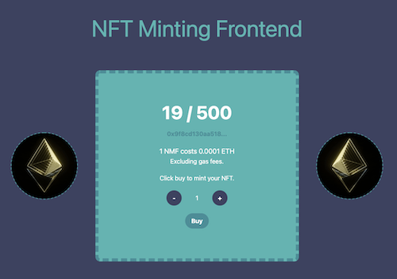

# Welcome to NFT Minting Frontend



This starter kit provides a nice and easy way for linking an existing NFT smart contract to this minting frontend.

Big thanks to HashLips because `NFT Minting Frontend` is customized from [HashLips/hashlips_nft_minting_dapp](https://github.com/HashLips/hashlips_nft_minting_dapp) ✨

## Demo

Demo site is here: <https://nft-minting-frontend.vercel.app/>

Contract Address: <https://rinkeby.etherscan.io/address/0x181b7df2526dd89ee724145e7937bc5caa077df8>

You can mint sample NFT on Rinkeby Network.

If you don't have any ETH, go to [Rinkeby Faucet](https://rinkebyfaucet.com/) and get 0.1 Rinkeby ETH.

## Usage

In order to make use of starter kit , all you need to do is change the configurations to point to your smart contract as well as update the images and theme file.

For the most part all the changes will be in the `store` folder.

To link up your existing smart contract, go to the `store/configAtom.ts` file and update the following fields to fit your smart contract and network details. The cost field should be in wei.

Note: this starter kit is designed to work with the intended NFT smart contract, that only takes one parameter(`mintAmount`) in the `mint` function. But you can change that in the `index.tsx` file if you need to use a smart contract that takes more params.

```typescript:store/configAtom.ts
// store/configAtom.ts
export const configAtom = atom<Config>({
  CONTRACT_ADDRESS: '0x9f8cd130aa518cb246e132c2f9100964eff245e3',
  SCAN_LINK: 'https://rinkeby.etherscan.io',
  NETWORK: {
    NAME: 'Rinkeby',
    SYMBOL: 'ETH',
    ID: 4,
  },
  NFT_NAME: 'NFT Minting Frontend',
  SYMBOL: 'NMF',
  MAX_MINT_AMOUNT: 10,
  MAX_SUPPLY: 500,
  WEI_COST: 100000000000000,
  GAS_LIMIT: 285000,
  SITE_NAME: 'NFT Minting Frontend',
})
```

Make sure you copy the contract ABI from like remix and paste it in the `contracts/abi.json` file.

Now you will need to change a `example.gif` in the `public/images` folder.

Next change the theme colors in the `tailwind.config.js` file.

```javascript:tailwind.config.js
// tailwind.config.js
theme: {
  extend: {
    colors: {
      primary: '#3D425F',
      secondary: '#4E8D97',
      accent: '#66B3B1',
    },
  },
}
```

Now you will need to change the `public/favicon.ico` to your brand images.

After all the changes you can run.

```bash
yarn install
```

and run the development server

```bash
yarn dev
```

Enjoy your NFT minting!
